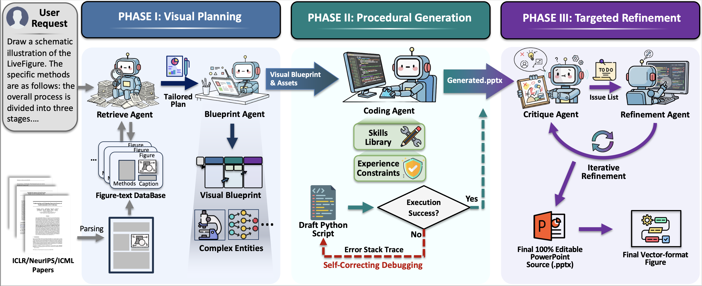

# LiveFigure: Automated Scientific Figure Generation System

## Overview

LiveFigure is an agentic framework that simulates the cognitive workflow of expert human designers to generate publication-quality scientific diagrams from textual descriptions. The system decomposes the figure generation task into three specialized stages that work together to produce editable PowerPoint figures with both semantic alignment and visual clarity.

## Architecture

The system follows a modular architecture organized around the three-stage pipeline. Each stage employs specialized components that work together to transform textual input into editable PowerPoint figures.

### Stage I Components: Visual Planning

- **VisualDeepResearcher** (`visual_researcher.py`)
  - Performs semantic search in vector database for reference images
  - Extracts design styles from retrieved images using VLM
  - Synthesizes multiple style analyses into unified style guide
  - Optional component that enhances generation quality when enabled

- **IconFactory** (`icon_factory.py`)
  - Generates complex icon assets in batch using grid-based strategy
  - Processes and slices sprite sheets
  - Manages icon asset library with style consistency

- **APIManager** (`api_clients.py`)
  - Handles image generation requests for blueprint creation
  - Provides unified interface for VLM communication

### Stage II Components: Procedural Generation

- **Tools** (`tools.py`)
  - Standardized skills library with high-level drawing utilities
  - Provides connectors, shapes, and text rendering functions
  - Handles advanced features like gradients and custom paths
  - Pre-validated atomic primitives that guarantee executability

- **Coder** (`coder.py`)
  - Generates Python code from visual references using VLMs
  - Incorporates experience-driven constraints from best practices
  - Implements self-correcting execution loop with error recovery

- **CoderPrompts** (`coder_prompts.py`)
  - Contains PPTX best practices and negative constraints
  - Evolving experience repository that prevents known error patterns

- **PPTRenderer** (`ppt_renderer.py`)
  - Executes generated Python code
  - Converts PPTX to PDF and PNG formats
  - Handles error recovery and file management

### Stage III Components: Visual Refinement

- **Coder** (`coder.py`)
  - Implements Actor-Critic pattern for iterative improvement
  - Generates visual critiques and applies surgical code modifications
  - Performs targeted refinement based on visual diagnostics

### Pipeline Orchestration

- **WorkflowManager** (`workflow_manager.py`)
  - Orchestrates the entire three-stage generation pipeline
  - Manages state and data flow across stages
  - Coordinates component interactions

## Workflow Pipeline

The following diagram illustrates the complete workflow of the LiveFigure system:



The system operates in three main stages:

### Stage I: Visual Planning via Prior Induction

This stage establishes reliable visual priors for figure generation by uncovering high-quality design patterns from top-tier conferences.

- **Visual Prior Induction** (Optional): When enabled, the system retrieves semantically relevant reference figures from a knowledge base and extracts design styles using VLM analysis. The extracted style guide influences subsequent blueprint generation.
- **Blueprint Generation**: Generates a visual blueprint based on the input text and extracted style constraints (if available).
- **Asset Generation**: For complex domain-specific entities, synthesizes style-consistent icon assets using a grid-based batch generation strategy.

**Key Components:**
- **VisualDeepResearcher** (`visual_researcher.py`): Performs semantic search and style extraction
- **IconFactory** (`icon_factory.py`): Generates complex icon assets in batch

### Stage II: Procedural Figure Generation via Skills and Experience

This stage maps the visual blueprint into executable PowerPoint generation scripts.

- **Standardized Skills**: Uses a pre-validated library of atomic drawing primitives that encapsulate complex rendering logic, guaranteeing code executability and enabling cognitive offloading.
- **Experience-Driven Constraints**: Incorporates evolving negative constraints from debugging experiences to prevent known error patterns.
- **Self-Correcting Execution Loop**: Implements iterative debugging with runtime feedback to handle execution failures autonomously.

**Key Components:**
- **Tools** (`tools.py`): Standardized skill library with high-level drawing utilities
- **Coder** (`coder.py`): Code generation with experience-driven constraints
- **CoderPrompts** (`coder_prompts.py`): Contains PPTX best practices and negative constraints
- **PPTRenderer** (`ppt_renderer.py`): Executes generated code and handles error recovery

### Stage III: Targeted Refinement via Visual Diagnostics

This stage employs a multi-modal closed-loop feedback mechanism to iteratively optimize generated figures.

- **Visual Diagnosis**: A VLM acts as a "visual critic" to identify subtle visual defects (e.g., element occlusion, inconsistent styling) that are invisible to code-level logic.
- **Surgical Refinement**: Applies incremental code modifications based on actionable feedback, preserving the overall structure while fixing specific issues.
- **Iterative Optimization**: Continues until visual quality meets publication standards.

**Key Components:**
- **Coder** (`coder.py`): Implements Actor-Critic pattern for visual refinement

## Key Design Principles

### 1. Visual Prior Induction
- Leverages high-quality exemplars from top-tier conferences
- Establishes reliable visual priors through semantic search and style extraction
- Ensures consistency with publication-quality design patterns

### 2. Standardized Skills and Experience
- Pre-debugged atomic primitives guarantee code executability
- Cognitive offloading enables focus on semantic layout decisions
- Evolving experience injection prevents known error patterns

### 3. Visual Diagnosis-Driven Refinement
- Multi-modal closed-loop feedback mechanism
- Surgical code modifications preserve structure
- Iterative optimization until visual quality meets standards

### 4. Modular Architecture
- Each component has a clear, single responsibility
- Clean separation between planning, generation, and refinement stages
- Easy to extend and maintain

## Installation

### Prerequisites

- Python 3.8+
- LibreOffice (for PPTX to PDF conversion)
- Required Python packages (see `requirements.txt`)

### Setup

1. Clone the repository:
```bash
git clone <repository-url>
cd LiveFigure
```

2. Install dependencies:
```bash
pip install -r requirements.txt
```

3. Configure environment variables:
```bash
export API_BASE="your_api_base_url"
export API_KEY="your_api_key"
export GEMINI_API_KEY="your_gemini_api_key"
export GEMINI_GEN_IMG_URL="your_gemini_image_generation_url"
export LIBREOFFICE_APP_PATH="/path/to/libreoffice/AppRun"

# Optional: Visual Deep Research configuration
export ENABLE_DEEP_RESEARCH="true"  # Enable reference retrieval and style extraction
export RESEARCHER_META_PATH="path/to/metadata.json"  # Path to reference metadata
export RESEARCHER_INDEX_PATH="path/to/index.npy"  # Path to vector index
export EMBEDDING_API_BASE="your_embedding_api_base"  # Embedding API endpoint
export EMBEDDING_API_KEY="your_embedding_api_key"  # Embedding API key
export EMBEDDING_MODEL_NAME="text-embedding-3-large"  # Embedding model name
export RETRIEVAL_TOP_K="3"  # Number of reference images to retrieve
```

4. Update configuration in `App/config.py` if needed:
   - Model names
   - Canvas dimensions
   - Maximum iterations
   - Output directory paths

## Usage

### Basic Usage

```python
from App.workflow_manager import WorkflowManager

manager = WorkflowManager()
success, message = manager.run(
    user_requirement="Your figure description here",
    output_dir=None  # Auto-create timestamped directory
)
```

### Batch Processing

```python
from App.batch_runner import BatchRunner

runner = BatchRunner()
runner.run()
```

Configure batch processing in `App/batch_runner.py`:
- `DATASET_PATH`: Path to JSONL dataset file
- `OUTPUT_ROOT`: Root directory for batch outputs
- `TEST_LIMIT`: Number of cases to process

## Configuration

### Model Configuration

The system supports multiple models for different tasks:

- **MODEL_CODER**: Used for code generation and refinement
- **MODEL_VLM**: Vision-language model for image understanding
- **MODEL_PLANNER**: Used for icon planning and description extraction
- **EMBEDDING_MODEL_NAME**: Used for semantic search in Visual Deep Research

### Visual Deep Research Configuration

When `ENABLE_DEEP_RESEARCH` is enabled, the system requires:

- **RESEARCHER_META_PATH**: Path to JSON file containing reference image metadata
- **RESEARCHER_INDEX_PATH**: Path to NumPy array file containing pre-computed embeddings
- **EMBEDDING_API_BASE**: API endpoint for embedding computation
- **EMBEDDING_API_KEY**: API key for embedding service
- **RETRIEVAL_TOP_K**: Number of top reference images to retrieve (default: 3)

### Runtime Parameters

- `MAX_ITERATIONS`: Number of Actor-Critic refinement rounds (default: 2)
- `PPT_WIDTH_Cm`: Canvas width in centimeters (default: 33.867)
- `PPT_HEIGHT_Cm`: Canvas height in centimeters (default: 19.05)

## File Structure

```
LiveFigure/
├── App/
│   ├── __init__.py
│   ├── main.py                 # Entry point
│   ├── config.py               # Configuration management
│   ├── workflow_manager.py     # Pipeline orchestration
│   ├── coder.py                # Code generation and refinement (Stage II & III)
│   ├── api_clients.py          # API management
│   ├── ppt_renderer.py         # Code execution and rendering (Stage II)
│   ├── icon_factory.py         # Icon asset generation (Stage I)
│   ├── visual_researcher.py   # Visual Deep Research module (Stage I)
│   ├── tools.py                # Standardized skills library (Stage II)
│   ├── coder_prompts.py       # Experience-driven constraints (Stage II)
│   └── batch_runner.py         # Batch processing
├── assets/
│   └── workflow.png            # Workflow diagram
├── requirements.txt            # Python dependencies
├── README.md                  # This file
└── SETUP.md                   # Setup instructions
```

## Output Structure

Each task generates a timestamped directory containing:

```
task_YYYYMMDD_HHMMSS/
├── requirement.txt                    # Original user requirement (Stage I input)
├── tools.py                          # Copy of standardized skills library
├── style_guide.json                  # Design style guide from Visual Prior Induction (Stage I)
├── 00_reference_gemini.png           # Visual blueprint (Stage I output)
├── assets/                            # Icon asset library (Stage I)
│   ├── assets_grid_sheet_raw.png
│   └── icon_*.png
├── 01_code_iter_0_*.py               # Initial executable script (Stage II)
├── 01_code_iter_0_*.pptx             # Initial editable figure (Stage II output)
├── 01_code_iter_0_*.png              # Rendered images
├── 02_critique_iter_1.txt            # Visual diagnosis feedback (Stage III)
├── 02_code_iter_1_*.py               # Refined script (Stage III)
├── 02_code_iter_1_*.pptx             # Final refined figure (Stage III output)
└── ...
```

## Technical Highlights

### Standardized Skills Library

The system uses a pre-validated library of atomic drawing primitives (`tools.py`) that encapsulate complex rendering logic, including intelligent connector routing, gradient lines, and custom paths. This abstraction guarantees code executability and significantly reduces complexity.

### Experience-Driven Error Prevention

An evolving repository of negative constraints (`coder_prompts.py`) prevents known error patterns by automatically injecting prohibitive rules into generation prompts, performing pre-pruning over the search space.

### Self-Correcting Execution

The system implements iterative debugging with runtime feedback, automatically fixing execution failures through error analysis and targeted code refinement.

### Visual Diagnosis-Driven Refinement

A structured visual inspection process evaluates critical dimensions (boundaries, connectors, text integrity, alignment) and generates actionable feedback for surgical code modifications.
